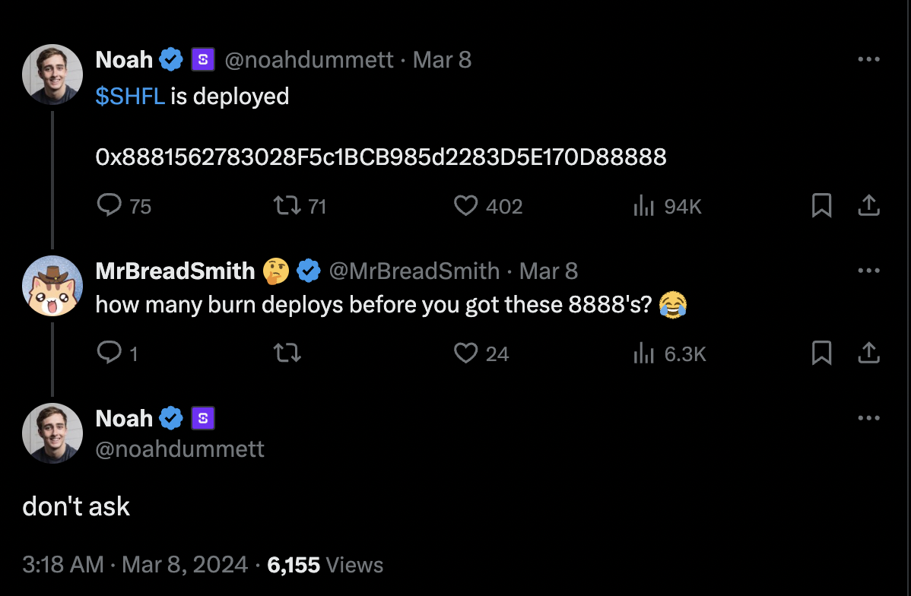
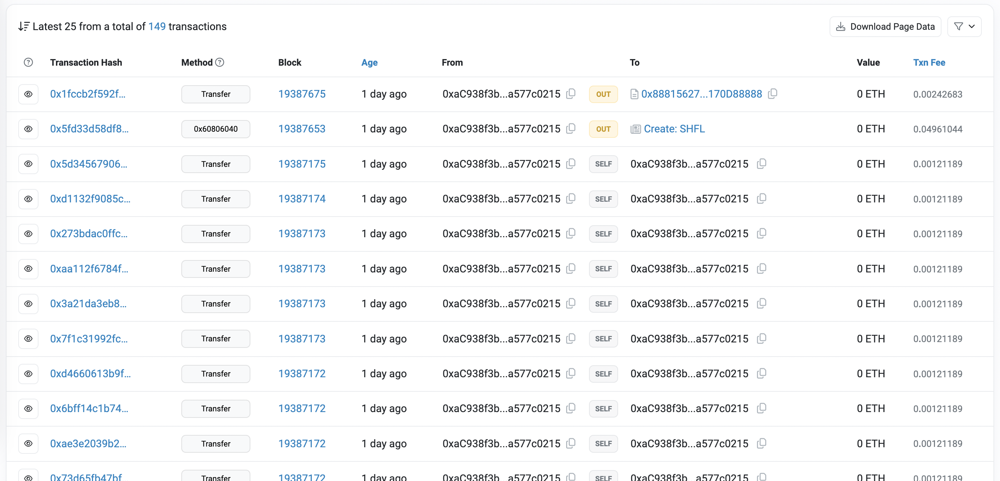
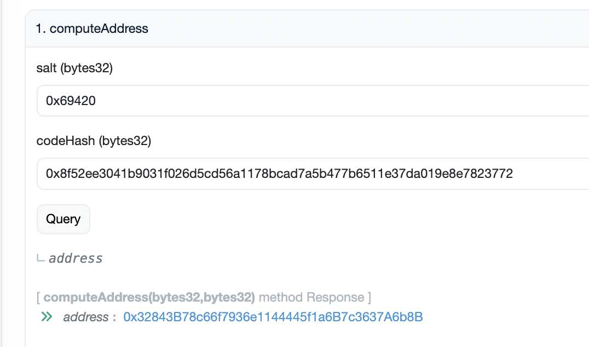
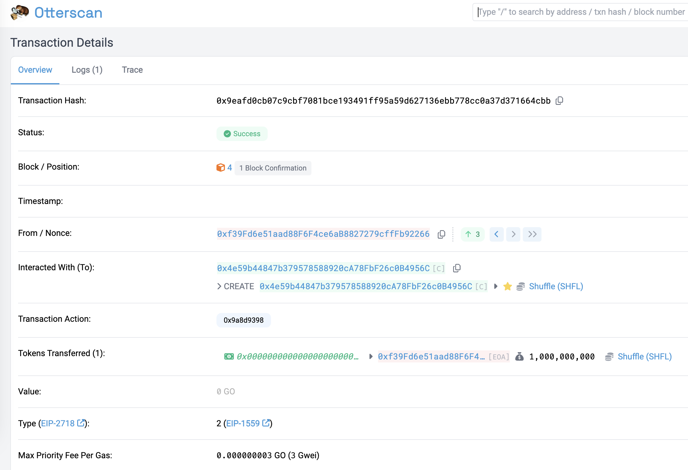
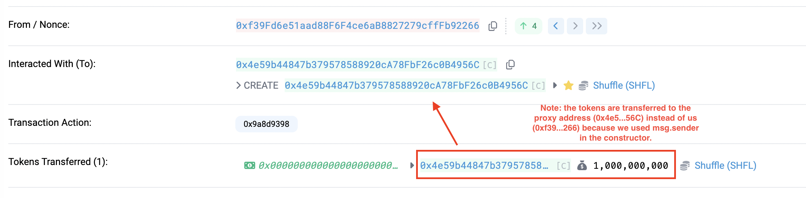

# Vanity ERC20

A repository to explain how to get vanity contract addresses for your ERC20 tokens.

# SHFL Token

### Background

At block 19387653 (chainid: 0x1), [Shuffle deployed their ERC20 contract](https://twitter.com/noahdummett/status/1765938975502713334) on mainnet for their [upcoming token](https://shfl.shuffle.com/), to address `0x8881562783028F5c1BCB985d2283D5E170D88888`.

After looking at the address, you'll notice they went for a vanity contract address, with [the lucky 8](https://www.istitutoitalocinese.org/en/eight-is-a-lucky-number/)'s, at the begining and at the end of the address.



You'll also notice that they burned ETH by doing a lot of `SELF` transactions to get to the correct nonce that would result in the `0x888...88888` address for the contract deploy. 

A quick calculation shows they burned `0.17ETH` (~$700) building their nonce value and some time offchain mining a good deploy address with a relatively low nonce (146) to get this vanity.



You can verify this by [downloading the transaction history from Etherscan](https://etherscan.io/exportData?type=address&a=0xac938f3bd1bdae37cc5087a84bac04ba577c0215) and importing the CSV into "Sheet 1". Then on a separate sheet, add the following formulas:

```
# Cell A1
# Sum total gas fees where SELF transaction
=sumif(Sheet1!F2:F,"0xac938f3bd1bdae37cc5087a84bac04ba577c0215",Sheet1!K2:K)

# Cell A2
# Get USD value of wasted ETH
=GOOGLEFINANCE("ETHUSD")*A1
```

### Technical Details

We can take a look at the transaction and see they used an old method to deploy the contract that computes the address with the following formula:

```
sha3(rlp.encode([normalize_address(sender), nonce]))[12:]
```

It takes the deployers address and the nonce of the transaction (in SHFL case these values are `aC938f3bd1bDAE37Cc5087A84BAC04ba577c0215` and `0x92` respectively).

Below is the Python code to generate this:

```py
import rlp
from sha3 import keccak_256 #pysha3

# We drop the 0x prefix from the deployer address
sender = bytes.fromhex("aC938f3bd1bDAE37Cc5087A84BAC04ba577c0215")

# The nonce of the tx (hex)
nonce = 0x92

# Last 20 bytes means the last 40 characters in hexadecimal
enc = rlp.encode([sender, nonce])
contract_address = keccak_256(enc).hexdigest()[-40:]

assert contract_address == "8881562783028f5c1bcb985d2283d5e170d88888" //true
```

This method to deploy contracts to generate an deterministic address requires either cycling through public keys or creating onchain transactions to increase your nonce value. Amongst other reasons, it was not ideal.

### Enter `CREATE2`

This is an opcode that was proposed through [eip-104](https://eips.ethereum.org/EIPS/eip-1014) from Vitalik Buterin, that allows us to generate deterministic addresses without requiring the nonce value to be included.

```
keccak256(0xff ++ deployingAddr ++ salt ++ keccak256(bytecode))[12:]
```

We can now deploy a contract to a specific address even if our nonce is `0x420` or `0x69` because the value is not included in the calculation to generate the contract address.

Shuffle did not use this method when they deployed SHFL token, and instead wasted 0.17ETH, even though the goal was to get a vanity contract address.

## How could Shuffle have done this?

CREATE2 has a lot of support, and even factory contracts onchain to help them deploy - and offchain tools to generate addresses without spending gas to execute transactions onchain.

### a) Using the onchain factory contracts

For example, this [CREATE2 Factory](https://etherscan.io/address/0x13b0D85CcB8bf860b6b79AF3029fCA081AE9beF2#readContract) (project: [`pcaversaccio/create2deployer`](https://github.com/pcaversaccio/create2deployer)) has a public method that allows us to calculate an address using a remote RPC server.



```sh
# Cast: https://book.getfoundry.sh/cast/

cast call 0x13b0D85CcB8bf860b6b79AF3029fCA081AE9beF2 --rpc-url https://cloudflare-eth.com/ "computeAddress(bytes32,bytes32)" 0x6942000000000000000000000000000000000000000000000000000000000000 0x8f52ee3041b9031f026d5cd56a1178bcad7a5b477b6511e37da019e8e7823772
```

This could be used with simple HTTP requests to an RPC node to generate an address based on a `bytes32 salt`  that they can choose (and `bytes32 codeHash`), effectively "mining" their desired contract address - in this example, we have chosen the salt `0x69420`.

Everytime we calculate an address with this specific code hash and salt, we will get the same address.

### b) Using `cast` to mine using their own machine

[Foundry Cast](https://book.getfoundry.sh/cast/) has support to mine specific vanity contract addresses locally. An example call would be:

```sh
cast c2 \
    --jobs 5 \
    --starts-with 0x888 \
    --ends-with 88888 \
    --init-code-hash 0x8f52ee3041b9031f026d5cd56a1178bcad7a5b477b6511e37da019e8e7823772
```

This will, after some time, output the "mined" contract address as well as the salt they need to supply in the CREATE2 deployment process.

```sh
Starting to generate deterministic contract address...
Successfully found contract address(es) in 70.470608041s
Address: 0x888A2f2c9885546D8A9d20D82DeB057344088888
Salt: 0xa3834ccd2ae5a08a84eea45473add35543b5ae4bc8d84e72086bb4cf729fb683 (73958981348587391866328902777403840297985898357049741650318481130841819821699)
```

### c) fuck it, using forge .sol scripts

For fun, I created a [Solidity script](./script/SHFL.s.sol) that could be used to generate a vanity smart contract address as part of their deployment pipeline - though it is not optimised (memory hog, single threaded).

Using [`forge`](https://book.getfoundry.sh/forge/), we can create a script that will mine for vanity addresses and then deploying it onchain.

```sh
cp .env.example .env # Copy example .env to usable file (change values in here)

source .env # Register the .env file

forge script script/SHFL.s.sol:VanityAddressScript # Mines for a vanity address
```

Once an address is mined, it'll tell you the address and give you a command to run to deploy the SHFL token.

```sh
[...]

== Logs ==
  

  Deployer address: 0xf39Fd6e51aad88F6F4ce6aB8827279cffFb92266
  Contract will be deployed to address: 0x844FbB8c98463b07CeDD6738327F1255F153DE08
  

SALT_FOR_VANITY_ADDRESS=0x9a8d93986a7b9e6294572ea6736696119c195c1a9f5eae642d3c5fcd44e49dea forge script script/SHFL.s.sol:SHFLScript --fork-url http://localhost:8545 --broadcast
```

Now, when we run that command and deploy the contract, we will get something like the following:

```
[...]
##
Sending transactions [0 - 0].
⠁ [00:00:00] [###########################################################################] 1/1 txes (0.0s)##
Waiting for receipts.
⠉ [00:00:00] [#######################################################################] 1/1 receipts (0.0s)
##### anvil-hardhat
✅  [Success]Hash: 0x9eafd0cb07c9cbf7081bce193491ff95a59d627136ebb778cc0a37d371664cbb
Block: 4
Paid: 0.002102087465674804 ETH (571082 gas * 3.680885522 gwei)
[...]
```



## Notes and Other

I have modified `SHFL.sol` contract address to take a parameter within the constructor to tell it where to send the initial 1B tokens.

It should not be `msg.sender` when doing CREATE2 method as sometimes this value will be the CREATE2 deployer proxy address and the tokens will be sent to the wrong intended address.

For example, if we proxy the CREATE2 through a factory contract that does not forward the deployer address as `tx.origin`, then the tokens will land in the proxy address.



Test cases on their ERC20 implementation.

```bash
forge test --match-path test/SHFL.t.sol # Run tests
```